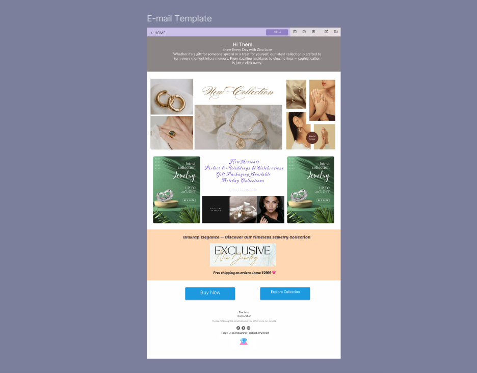

# Task 2: Email Template Design

## Task Overview
An email template is a pre-designed email that can be used to send out marketing or promotional emails. The goal of a good email template is to make it easy and quick for businesses to send out emails that look professional and engaging.

---
## Tool Used
- **Figma** 

---
## 📷 Screenshots
>

---
## Prototype Link
[Click here to view the prototype](https://www.figma.com/proto/ejIqqvIIMfaKGspNyPo5lP/Smart-Watch-E-mail-Template--Community-?node-id=1-2&p=f&m=draw&scaling=scale-down&content-scaling=fixed&page-id=0%3A1&t=ZRKk1CtVloGEeJi9-1)

---

